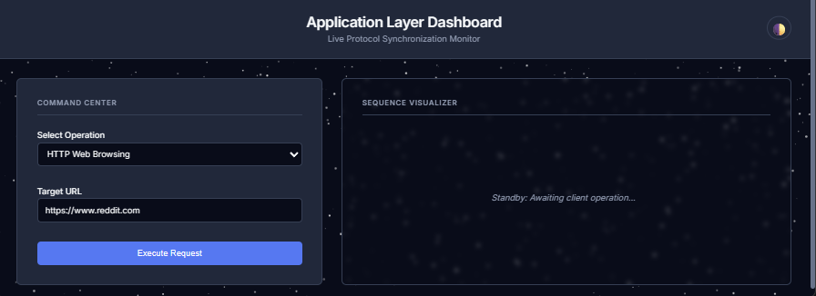
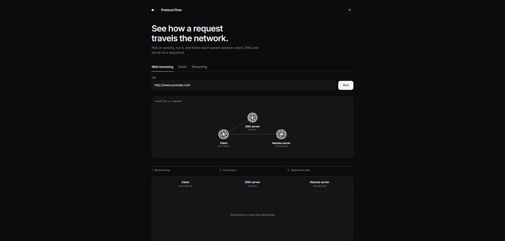

# TCP/IP Protocol Flow Visualizer

A sleek FastAPI application with a modern front-end that illustrates how network packets travel across layers (DNS, TCP, and Application protocols like HTTP, SMTP, or HLS Streaming) using an interactive 3D scene alongside a step-by-step sequence log.

- **Backend:** `main.py` (FastAPI) serves the application and exposes three core endpoints:
  `POST /api/browse`, `POST /api/mail`, `POST /api/stream`.
  Each endpoint returns an ordered sequence array: `{"sequence": [{type, sender, receiver, protocol, msg}, ...]}`.
- **Frontend:** `index.html` (single-file UI, no complex build pipeline). Utilizes Three.js and modern CSS variables for a dark/light mode interface. Includes an offline fallback demo mode if the backend is unreachable.

---

## Visual Previews & Version Comparison

### 1. Previous Version (`app_layer_workflow01`)
* **Layers Covered:** Application Layer view only (DNS resolution + HTTP/SMTP/Streaming message logs).
* **UI Focus:** Standard two-panel text logs with manual replay controls.


*(Placeholder: Add your screenshot for the previous application-layer-only version)*

### 2.('protocol-visualizer-0.2')
* **Layers Covered:** Application Layer **plus Transport Layer** (TCP three-way handshakes: `SYN`, `SYN-ACK`, `ACK`).
* **UI Focus:** Modern minimal dashboard featuring an interactive 3D Three.js node topology canvas (Client, DNS Server, Remote Server) with animated packet routing.


*(Placeholder: Add your screenshot for the updated 3D TCP/IP visualizer version)*

---

## Version History

| Version | Layers Covered | UI & Architecture |
| :--- | :--- | :--- |
| `app_layer_workflow01` (Previous) | Application layer view only | Standard dual-panel log view |
| **Current Version** | Application layer **+ Transport layer** | Live 3D node topology + Sequence timeline |

### Roadmap

Future updates aim to cover the entire TCP/IP stack:

| Layer | Status |
| :--- | :--- |
| Application (DNS, HTTP, SMTP, HLS streaming) | Done |
| Transport (TCP 3-Way Handshake) | Done |
| Internet (IP) | Planned |
| Link / Network Access | Planned |

---

## Technical Notes

* **Live vs. Simulated Data:** The DNS lookup in `/api/browse` is live and dynamic (`socket.gethostbyname` on the server host). TCP connection handshakes and application payloads use descriptive simulated traces for educational clarity.

---

## Run Locally

```bash
git clone [https://github.com/BishalRoy001/App_layer_workflow.01.git](https://github.com/BishalRoy001/App_layer_workflow.01.git)
cd App_layer_workflow.01
pip install -r requirements.txt
uvicorn main:app --reload
